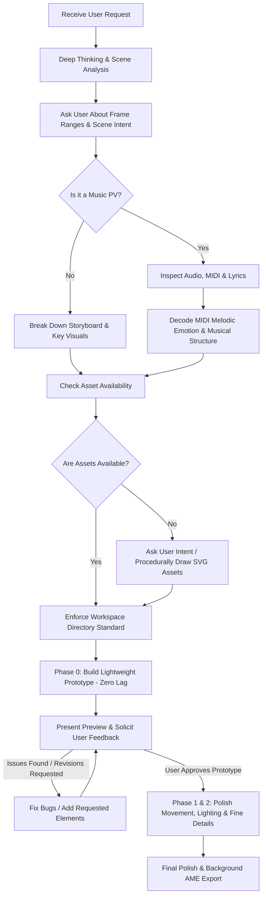

# After Effects Motion Design & Music PV Master Workflow (Skill)

This skill guides AI agents on collaborating with users to create industry-grade After Effects animations and Music PVs (Promotional Videos) using the `after-effects-mcp` toolchain. It establishes strict rules for workspace structure, performance safeguarding against crashes, MIDI melody analysis & emotional decoding, comprehensive music genre visual styles, and an iterative user-driven lifecycle.

---

## 1. Core Lifecycle & User Collaboration Protocol

Never jump directly into complex, heavy effects that can cause After Effects to stutter or crash. You must strictly execute the following closed-loop pipeline:



### Step 1: Think First, Then Ask
1. **Internal Reasoning (Think Deeply)**:
   - Identify the user's primary emotional and aesthetic intent (e.g., explosive sci-fi, epic cybernetic, warm storybook, cozy pastel, lively cute, dark ambient, synthwave, lo-fi, etc.).
   - Pinpoint the exact frame intervals (e.g., `frame 900 to 1200`, `30s to 40.30f`).
2. **Clarify with the User**:
   - Always ask specifically: *"Between frame [X] (or [XX]s) and frame [Y] (or [YY]s), what specific visual action, focal subject, or emotional atmosphere would you like to see?"*
   - Never assume complex story beats or transitions without user alignment.

### Step 2: Music PV Audio, MIDI & Lyrics Handling
When the project involves a music track, MIDI file, or PV:

#### A. MIDI (.mid) File Melody Analysis & Emotional Decoding
If the user provides a `.mid` / MIDI file (or stems):
1. **Algorithmic Inspection**:
   - Parse the MIDI tracks using Python (`mido` / `pretty_midi`) or Node.js (`@tonejs/midi`):
     - **Track Separation**: Identify Melody (Lead), Harmony (Chords), Bassline, and Drums/Percussion.
     - **Pitch Range & Register**: High octave register (> C6) often signifies innocence, vulnerability, or crystalline wonder; low register (< C3) signifies heaviness, threat, or grounding warmth.
     - **Melodic Contour**: Ascending intervals evoke hope, struggle, aspiration; descending intervals evoke melancholy, surrender, or relaxation.
     - **Tonality & Modes**: Major scale (joyful, radiant, heroic) vs. Minor scale (melancholic, intense, mysterious) vs. Dorian/Lydian (dreamlike, fantasy, uplifting nostalgia).
     - **Velocity & Articulation**: High velocity variance with staccato notes reflects playful, energetic, or frantic emotion; legato phrasing with smooth note overlaps reflects gentle tenderness, sorrow, or romance.
     - **Tempo (BPM) & Meter**: Fast (>140 BPM) suggests excitement, combat, or joy; moderate (90-120 BPM) suggests groove, walking, reflective narrative; slow (<80 BPM) suggests deep emotional contemplation, ballads, or ambient calm.
2. **Harmonic Emotion Mapping**:
   - Correlate MIDI note transitions with visual timing markers: each key melody leap (e.g., octave jump, leading tone resolution) should anchor a visual punch, camera direction switch, or lighting pulse.

#### B. Lyrics & Song Structure Extraction
1. **Locate Lyrics**:
   - **Check Local Files First**: Search the audio file's directory for associated lyric files (`.lrc`, `.txt`, `.srt`). If present, parse timestamps and line-by-line markers.
   - **Ask the User**: If no lyrics file is found locally, prompt the user: *"Could you provide the lyrics or a synced .lrc file for this song?"*
   - **Web Search Fallback**: If the user does not have the lyrics either, proactively perform a web search to fetch official lyrics, artist metadata, and timing references, then verify them with the user.
2. **Musical Structure & Emotion Alignment**:
   - Segment the song: `Intro` -> `Verse` -> `Pre-Chorus / Build-up` -> `Chorus / Drop` -> `Bridge` -> `Outro`.
   - **Emotion Inquiry**: Ask the user: *"What emotional tone should this specific section [Frame X to Y] carry (e.g., quiet melancholy, gentle warmth, bubbly joy, overwhelming climax)?"*
   - **Autonomous Inference**: If the user leaves the emotion open, combine the decoded MIDI melodic valence, lyrical themes, and rhythm drops to infer the emotional atmosphere, then present your proposal for confirmation.

### Step 3: Asset Acquisition & Procedural SVG Generation
- **User-Provided Assets**: Check `assets/` first for user footage, illustrations, logos, or textures.
- **Procedural SVG Drawing**: When required assets are missing, generate crisp, modern SVGs procedurally (via Python or Node scripts) matching the exact musical genre and emotion:
  - *Tech/Epic Themes*: Neural network topologies, Transformer multi-head attention diagrams, holographic HUD rings, audio spectrum waveforms, circuit paths.
  - *Warm/Cute Themes*: Soft rounded clouds, cute stars, botanical leaves, doodle hearts, cozy coffee cups, cat paws, hand-drawn speech bubbles.
  - *Cyberpunk/Glitch*: Neon warning glyphs, broken wireframes, digital barcode badges, cyber skulls.
  - *Fantasy/Orchestral*: Golden filigree, celestial constellations, vintage clockwork gears, sacred geometry.
- Save all generated graphics into `assets/svg/` and import them via `importAsset`.

---

## 2. Workspace Directory Specification

All project files must strictly follow this clean directory architecture:

```text
<Project_Root>/
├── assets/                 # All imported & raw external media
│   ├── audio/              # Music tracks (.mp3, .wav), MIDI (.mid), and lyric files (.lrc, .srt)
│   ├── svg/                # Procedural & custom vector artwork
│   ├── images/             # Character sprites, photos, cutouts
│   └── textures/           # Glow maps, grain overlays, paper textures
├── output/                 # Renders and exported media
│   ├── previews/           # Rapid frame snapshots & lightweight preview clips
│   └── final/              # High-bitrate master exports via Adobe Media Encoder (AME)
├── skill/                  # Workflow skill instructions
│   └── after-effects-workflow/
│       └── SKILL.md
└── <Project_Name>.aep      # Master Adobe After Effects project file
```

---

## 3. Staged Production & Performance Safeguards

> [!CAUTION]
> **Cardinal Rule**: Heavy motion blur, multi-pass blurs, unoptimized glow stacks, and complex 3D raytracing will severely degrade AE preview performance and trigger crashes. **The initial draft MUST be an ultra-lightweight prototype!**

### Phase 0: Lightweight Prototype (Zero-Lag Blueprint)
- **Goal**: Lock down composition structure, layer hierarchy, camera moves, typography rhythm, and transition timing.
- **Strict Guidelines**:
  - Keep layers clean: rely on Shape Layers, Solid Layers, Text Layers, and Null Objects.
  - Keep blur and heavy glow filters **disabled** during this phase.
  - Turn off camera Depth of Field (`enableDepthOfField: false`).
  - Use `precomposeLayers` early to group scene blocks into tidy sub-compositions (`Scene_01_Intro`, `Scene_02_Verse`, etc.).
  - Deliver quick low-resolution MP4 previews (`exportPreviewVideo`, `scale: 0.5`, `fps: 30`) or frame snapshots (`exportFrame`).

### Phase 1: Iterative Feedback & Problem Rectification
- Review the prototype with the user.
- If the user notes stiffness: adjust keyframe easing curves with `setKeyframeVelocity` (e.g., `influence: 65% - 85%`).
- If layer stacking order is wrong: use `reorderLayer` (`moveBefore`, `moveAfter`, `moveToBeginning`, `moveToEnd`).
- If any bug occurs or user requests additions: solve specifically without disturbing existing working layers.

### Phase 2: Final Polish & Master Delivery (Only After Approval)
- When the user explicitly states: *"It looks good"*, *"Approved"*, or *"Proceed to details"*:
  - Apply style-specific visual flourishes (Glow, Light Rays, Texture Overlays, Trim Paths).
  - Add character-level text animators (`addTextAnimator`: `fade_up_chars`, `scale_pop_chars`, `glitch_decoder`, etc.).
  - Queue the final composition into Adobe Media Encoder (`exportWithAME`) for high-quality background hardware rendering without freezing AE.

---

## 4. Universal Music Genre Visual Style Guide (Visual Aesthetics for All Genres)

Every musical genre dictates a unique visual grammar, color harmony, typography dynamic, and camera kinetics:

---

### 1. Warm, Cozy & Cute / Kawaii / Healing (温馨可爱 / 治愈系)
- **Musical Characteristics**: Gentle acoustic guitar, sweet piano, ukulele, lofi hiphop beats, playful chiptune melodies.
- **Color Palette**: Pastel palette — warm cream white (`#FFFDF7`), peach blush (`#FFB7B2`), butter yellow (`#FFE4A0`), mint green (`#B5EAD7`), lilac lavender (`#E2C6FF`). Deep navy or milk chocolate for text instead of harsh pure black.
- **Motion & Physics**:
  - Bouncy elastic pop-in: `Scale: 0% -> 112% -> 98% -> 100%` (Overshoot bounce).
  - Continuous gentle floating expression: `value + [0, Math.sin(time * 3) * 8];`.
  - Subtle breathing wiggle: `wiggle(1.2, 5)`.
  - Squash and stretch on impacts: `[115, 85]` on contact, restoring to `[100, 100]`.
- **Graphic Motifs**: Generous corner radii (`roundness: 25-50`), rounded cloud puffs, doodle stars, hand-drawn hearts, coffee cups, cat paws, sticker borders with rounded dash strokes.
- **Camera & Lighting**: Ultra-wide low-intensity warm ambient glow (`Threshold: 75%`, `Radius: 150`, `Intensity: 0.35`). Gentle drifting pan & tilt without violent jerks. Paper/parchment grain texture overlay at 10% opacity.

---

### 2. Epic Cinematic & Intense Cyberpunk / Future Bass (燃向 / 赛博科技 / 电影级震撼)
- **Musical Characteristics**: Heavy synth drops, electro-industrial, dubstep growls, fast breakbeats, orchestral hybrid epicness.
- **Color Palette**: Deep midnight black (`#07080D`), cyan electric blue (`#00F0FF`), hot magenta (`#FF0055`), acid neon yellow (`#FAFF00`).
- **Motion & Physics**:
  - Snap-and-Drift camera: 4-6 frame high-velocity rushes (`influence: 85%`) into subtle camera creep.
  - Z-space tunnel penetration: Camera rushes through midground shapes straight into subsequent compositions.
  - Drop impact: 1-2 frame Difference Strobe flashes or chromatic aberration burst on transient peaks.
- **Lighting Architecture**: Dual-layer glow:
  1. Core hot laser: `Radius: 6`, `Intensity: 1.8`, `Threshold: 50%`.
  2. Atmospheric bloom: `Radius: 120`, `Intensity: 0.45`, `Threshold: 65%`.
- **Graphic Motifs**: Transformer attention schematics, neural networks, circuit paths with `Trim Paths`, holographic HUD reticles, glitch distortion.

---

### 3. Lo-Fi Hip Hop & Chillhop / Nostalgic Vintage (复古低保真 / 慢节奏放空)
- **Musical Characteristics**: Vinyl crackle, mellow rhodes piano, slow swing drums (75-88 BPM), muted trumpet.
- **Color Palette**: Dusty muted vintage tones — faded ochre (`#DDA15E`), sage green (`#606C38`), muted terracotta (`#BC6C25`), warm beige (`#FEFAE0`).
- **Motion & Physics**:
  - Deliberate, relaxed low-frame-rate feel: apply `Posterize Time` at 12fps or 15fps.
  - Slow horizontal drifting camera, subtle zoom in over long 8-second stretches.
- **Graphic Motifs & Textures**: Cassette tapes, vintage windows UI dialogs, coffee steam loops, streetlamps at dusk, vinyl record grooves.
- **Effects & Shading**: Subtle scanlines, RGB chromatic fringing (1-2px shift), gentle lens blur edge vignetting, animated dust and scratch overlays.

---

### 4. Synthwave & Retrowave / 80s Cyber (复古霓虹蒸汽波)
- **Musical Characteristics**: Analog arpeggios, gated reverb snare, pumping sidechain basslines, dramatic saxophone solos.
- **Color Palette**: Neon pink (`#FF007F`), vibrant purple (`#7928CA`), electric blue (`#00E5FF`), sunset gradient orange (`#FF6B00`).
- **Motion & Physics**: Continuous forward motion over an endless perspective 3D grid line plane, rhythmically linked to the 4-on-the-floor kick drum.
- **Graphic Motifs**: Wireframe perspective grid floor, wireframe neon mountains, segmented wireframe sunset sun, chrome metallic 3D text.
- **Effects & Shading**: Strong horizontal optical anamorphic flares, CRT monitor curved screen distortion, starburst specular highlights.

---

### 5. Classical, Orchestral & Epic Symphonic (古典交响 / 史诗管弦)
- **Musical Characteristics**: Grand strings, brass fanfares, timpani rolls, delicate harp glissandos, choir crescendo.
- **Color Palette**: Royal gold (`#E5A93C`), deep obsidian black (`#0C0D10`), velvet burgundy (`#4A0E17`), ivory marble white (`#F4F1EA`).
- **Motion & Physics**:
  - Sweeping, regal crane shots and orbital 3D camera arcs around central subjects.
  - Keyframe velocity curve matches musical dynamics (smooth, graceful S-curves with long decay times).
- **Graphic Motifs**: Ornate golden filigree, celestial star charts, architectural arches, sheet music staves, floating particulate gold embers.
- **Effects & Shading**: Volumetric god rays (CC Light Rays), elegant lens flares, rich depth of field bokeh.

---

### 6. Rock & Heavy Metal / Grunge (摇滚重金属 / 暗黑朋克)
- **Musical Characteristics**: Distorted power chords, double bass drum kicks, aggressive guitar solos, raw screams.
- **Color Palette**: Blood red (`#E63946`), charcoal black (`#141414`), concrete gray (`#6C757D`), harsh pure white (`#FFFFFF`).
- **Motion & Physics**:
  - Aggressive camera shake expression: `wiggle(18, 14)` tied to guitar riffs.
  - Rapid flash cuts (3-5 frames per cut) alternating between high-contrast silhouettes and stark typography.
- **Graphic Motifs**: Torn paper collage edges, barbed wire, spray-paint stencils, distressed grunge typography, scratched film borders.
- **Effects & Shading**: High-contrast thresholding (black & white crunch), heavy film grain, strobe flashes on snare hits.

---

### 7. City Pop & Retro Japanese 80s Disco (都市流行 / 复古摩登)
- **Musical Characteristics**: Slap bass, breezy brass stabs, sparkling synthesizer, upbeat funky dance rhythms (110-125 BPM).
- **Color Palette**: Resort turquoise (`#00B4D8`), tropical coral (`#FF6F61`), lemon chiffon (`#FFF3B0`), midnight sapphire (`#03045E`).
- **Motion & Physics**: Rhythmic stepping zooms, sliding geometric colored banners, snappy typography wipes that slice diagonally across the frame.
- **Graphic Motifs**: Palm tree silhouettes, high-rise urban skylines at night, cocktail glasses, pastel geometric confetti, bold pop-art half-tone dots.
- **Effects & Shading**: Prism rainbow chromatic split, clean glossy highlights, 80s anime-style hand-drawn light glints.

---

### 8. EDM / Trap / Hardstyle Festival (电音节 / 派对狂欢)
- **Musical Characteristics**: Build-up risers (white noise sweep), accelerating snare rolls, earth-shaking 808 sub-bass drops.
- **Color Palette**: Ultra-saturated triadic lasers: Laser green (`#39FF14`), electric purple (`#BF00FF`), laser orange (`#FF5E00`), hyper cyan (`#00FFFF`).
- **Motion & Physics**:
  - Build-up phase: Progressive camera zoom and escalating rotational oscillation (`wiggle` frequency scaling with the snare roll).
  - Drop phase: Explosive scale shockwave burst + radial blur pulse + rapid background color inversion.
- **Graphic Motifs**: Audio spectrum visualizer bars (`Audio Spectrum` effect), pulsating geometric rings, laser beams, sound-wave ripples.

---

### 9. Melancholic Ballad & Indie Folk (深情叙事 / 伤感民谣)
- **Musical Characteristics**: Soft acoustic strumming, solitary piano keys, intimate breathy vocals, sparse instrumentation.
- **Color Palette**: Rainy slate blue (`#4A5568`), misty fog gray (`#CBD5E0`), faded timber wood (`#8D6E63`), pale candlelight amber (`#FFD166`).
- **Motion & Physics**: Minimalist slow pans, long lingering shots (6-12 seconds), slow dissolve crossfades (1.5-2.0s duration).
- **Graphic Motifs**: Water ripple rings, autumn falling leaves, solitary window frames, raindrops on glass, minimalist single-line vector art.
- **Effects & Shading**: Subtle rain particle generation, moody edge vignette, soft defocus transitions between memories/scenes.

---

### 10. Dark Ambient & Horror / Industrial Mystery (暗黑氛围 / 悬疑惊悚)
- **Musical Characteristics**: Low droning sub-frequencies, metallic scrapes, reverse audio swells, eerie silence punctuated by shocks.
- **Color Palette**: Deep abyss green (`#0B130E`), dried crimson (`#480A0A`), oxidized copper (`#2C5D63`), deep shadow black (`#050505`).
- **Motion & Physics**: Claustrophobic slow creeping forward zooms, sudden erratic glitch stutters, slow rotational tilts that create disorientation.
- **Graphic Motifs**: Digital static noise, glitch barcode fragmentation, biometric monitors, occult symbols, decayed textures.
- **Effects & Shading**: Displacement map distortion using turbulent noise, heavy color desaturation, flickering exposure dropouts.

---

## 5. AE MCP Tooling Quick Reference

| Tool | Core Responsibility | Strategic Advice |
| :--- | :--- | :--- |
| `precomposeLayers` | Encapsulate scene segments into sub-comps; organize messy timelines | Preserve 3D transformations; assign semantic names (`Scene_01_Intro`, `UI_HUD_Precomp`). |
| `reorderLayer` | Fix visual occlusion; adjust layer hierarchy | Use `moveBefore` / `moveAfter` with layer names; `moveToBeginning` for master adjustment layers. |
| `createCameraRig` | Deploy professional 2-node camera with Null position/rotation rig | Turn off Depth of Field during prototype drafting; re-enable only for final polish. |
| `addTextAnimator` | Apply character-level typography kinetics | Use `fade_up_chars` for clean lyrics, `glitch_decoder` for cyber, `scale_pop_chars` for bouncy cute lyrics. |
| `setKeyframeVelocity` | Refine motion curves and ease curves | High influence (`75%-85%`) for energetic snap; moderate (`50%-65%`) for cute organic bobbing. |
| `exportPreviewVideo` | Export rapid, low-weight MP4 preview files | Use `scale: 0.5` at 30fps to guarantee rapid rendering without blocking AE. |
| `exportWithAME` | Queue composition into Adobe Media Encoder | Master export pipeline; renders in the background using GPU acceleration without freezing AE. |

---

## 6. Crash Recovery & Resilience Guidelines

1. **Auto-Relaunch Recovery**:
   - The MCP bridge features autonomous crash detection. When `AfterFX.exe` exits unexpectedly, the daemon terminates stuck crash reporters and relaunches After Effects.
   - You must pause execution, wait for heartbeat restoration, and inform the user: *"Detected After Effects unexpected exit; successfully re-launched and reconnected. Resuming pipeline..."*
2. **Layer Stacking Drift Defense**:
   - Always verify layer names and current indices with `getLayerInfo` after batch additions.
   - When referencing existing layers, prefer `layerName` over volatile numeric indices.
3. **Continuous Project Safety**:
   - Save periodically using `saveProject` before and after major structural edits.
   - Isolate experimental visual styles into dedicated precomps using `precomposeLayers` to prevent damaging parent layouts.
