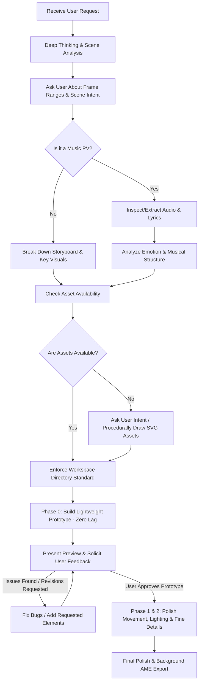

# After Effects Motion Design & Music PV Master Workflow (Skill)

This skill guides AI agents on collaborating with users to create industry-grade After Effects animations and Music PVs (Promotional Videos) using the `after-effects-mcp` toolchain. It establishes strict rules for workspace structure, performance safeguarding against crashes, style-specific design theory (both intense/cinematic and warm/cozy/cute styles), and an iterative user-driven lifecycle.

---

## 1. Core Lifecycle & User Collaboration Protocol

Never jump directly into complex, heavy effects that can cause After Effects to stutter or crash. You must strictly execute the following closed-loop pipeline:



### Step 1: Think First, Then Ask
1. **Internal Reasoning (Think Deeply)**:
   - Identify the user's primary emotional and aesthetic intent (e.g., explosive sci-fi, epic cybernetic, warm storybook, cozy pastel, lively cute).
   - Pinpoint the exact frame intervals (e.g., `frame 900 to 1200`, `30s to 40.30f`).
2. **Clarify with the User**:
   - Always ask specifically: *"Between frame [X] (or [XX]s) and frame [Y] (or [YY]s), what specific visual action, focal subject, or emotional atmosphere would you like to see?"*
   - Never assume complex story beats or transitions without user alignment.

### Step 2: Music PV Audio & Lyrics Handling
When the project involves a music track or PV:
1. **Locate Audio and Lyrics**:
   - **Check Local Files First**: Search the audio file's directory for associated lyric files (`.lrc`, `.txt`, `.srt`). If present, parse timestamps and line-by-line markers.
   - **Ask the User**: If no lyrics file is found locally, prompt the user: *"Could you provide the lyrics or a synced .lrc file for this song?"*
   - **Web Search Fallback**: If the user does not have the lyrics either, proactively perform a web search to fetch official lyrics, artist metadata, and timing references, then verify them with the user.
2. **Musical Structure & Emotion Analysis**:
   - Segment the song: `Intro` -> `Verse` -> `Pre-Chorus / Build-up` -> `Chorus / Drop` -> `Bridge` -> `Outro`.
   - **Emotion Inquiry**: Ask the user: *"What emotional tone should this specific section [Frame X to Y] carry (e.g., quiet melancholy, gentle warmth, bubbly joy, overwhelming climax)?"*
   - **Autonomous Inference**: If the user leaves the emotion open, analyze the lyrical themes, tempo (BPM), and harmonic energy to infer the appropriate emotional landscape, presenting your proposal for confirmation.

### Step 3: Asset Acquisition & Procedural SVG Generation
- **User-Provided Assets**: Check `assets/` first for user footage, illustrations, logos, or textures.
- **Procedural SVG Drawing**: When required assets are missing, generate crisp, modern SVGs procedurally (via Python or Node scripts) based on the scene's emotional tone:
  - *Tech/Epic Themes*: Neural network topologies, Transformer multi-head attention diagrams, holographic HUD rings, audio spectrum waveforms, circuit paths.
  - *Warm/Cute Themes*: Soft rounded clouds, cute stars, botanical leaves, doodle hearts, cozy coffee cups, cat paws, hand-drawn speech bubbles.
- Save all generated graphics into `assets/svg/` and import them via `importAsset`.

---

## 2. Workspace Directory Specification

All project files must strictly follow this clean directory architecture:

```text
<Project_Root>/
├── assets/                 # All imported & raw external media
│   ├── audio/              # Music tracks (.mp3, .wav) and lyric files (.lrc, .srt)
│   ├── svg/                # Procedural & custom vector artwork
│   ├── images/             # Character sprites, photos, cutouts
│   └── textures/           # Glow maps, grain overlays, paper textures
├── output/                 # Renders and exported media
│   ├── previews/           # Rapid frame snapshots & lightweight preview clips
│   └── final/              # High-bitrate master exports via Adobe Media Encoder (AME)
├── skill/                  # Workflow skill instructions
│   └── after-effects-workflow/
│       └── SKILL.md
└── <Project_Name>.aep      # Master Adobe After Effects project file
```

---

## 3. Staged Production & Performance Safeguards

> [!CAUTION]
> **Cardinal Rule**: Heavy motion blur, multi-pass blurs, unoptimized glow stacks, and complex 3D raytracing will severely degrade AE preview performance and trigger crashes. **The initial draft MUST be an ultra-lightweight prototype!**

### Phase 0: Lightweight Prototype (Zero-Lag Blueprint)
- **Goal**: Lock down composition structure, layer hierarchy, camera moves, typography rhythm, and transition timing.
- **Strict Guidelines**:
  - Keep layers clean: rely on Shape Layers, Solid Layers, Text Layers, and Null Objects.
  - Keep blur and heavy glow filters **disabled** during this phase.
  - Turn off camera Depth of Field (`enableDepthOfField: false`).
  - Use `precomposeLayers` early to group scene blocks into tidy sub-compositions (`Scene_01_Intro`, `Scene_02_Verse`, etc.).
  - Deliver quick low-resolution MP4 previews (`exportPreviewVideo`, `scale: 0.5`, `fps: 30`) or frame snapshots (`exportFrame`).

### Phase 1: Iterative Feedback & Problem Rectification
- Review the prototype with the user.
- If the user notes stiffness: adjust keyframe easing curves with `setKeyframeVelocity` (e.g., `influence: 65% - 85%`).
- If layer stacking order is wrong: use `reorderLayer` (`moveBefore`, `moveAfter`, `moveToBeginning`, `moveToEnd`).
- If any bug occurs or user requests additions: solve specifically without disturbing existing working layers.

### Phase 2: Final Polish & Master Delivery (Only After Approval)
- When the user explicitly states: *"It looks good"*, *"Approved"*, or *"Proceed to details"*:
  - Apply style-specific visual flourishes (Glow, Light Rays, Texture Overlays, Trim Paths).
  - Add character-level text animators (`addTextAnimator`: `fade_up_chars`, `scale_pop_chars`, `glitch_decoder`, etc.).
  - Queue the final composition into Adobe Media Encoder (`exportWithAME`) for high-quality background hardware rendering without freezing AE.

---

## 4. Visual Aesthetics & Design Playbook

Design approaches differ fundamentally depending on the desired emotional mood. Apply the appropriate technique set:

---

### A. Warm, Cozy & Cute Style (温馨可爱 / 治愈系风格)

When creating scenes for gentle melodies, slice-of-life storytelling, acoustic songs, or playful animations:

#### 1. Color Palette & Harmony
- **Soft Tones**: Use pastel tones, warm creamy whites (`#FFFDF7`), soft peach (`#FFB7B2`), butter yellow (`#FFE4A0`), mint green (`#B5EAD7`), and warm blush pink (`#FFDAC1`).
- **Low Contrast, High Warmth**: Avoid harsh pitch-black backgrounds; use warm dark chocolate or deep navy for outlines and text instead of pure `#000000`.

#### 2. Organic Motion & Playful Easing (Bouncy / Spring Physics)
- **Elastic & Overshoot Keyframes**:
  - Use playful bounce: objects pop in slightly larger (`Scale: 0% -> 112% -> 98% -> 100%`) with gentle elasticity.
  - Cute bobbing/floating expressions: apply subtle vertical floating via expressions:
    ```javascript
    // Gentle floating bob
    yOffset = Math.sin(time * 3) * 8;
    value + [0, yOffset];
    ```
- **Wiggle with Low Frequency**:
  - Keep frequency slow and amplitude small: `wiggle(1.2, 5)` to simulate living, breathing warmth.
- **Squash and Stretch**:
  - When elements jump, drop, or land, scale horizontally while compressing vertically (`[115, 85]` on impact, returning to `[100, 100]`).

#### 3. Graphic Elements & SVG Motifs
- **Rounded Geometries**: Use high corner radii (`roundness: 25-50`) on all rectangles and shapes. Sharp angles destroy coziness.
- **Hand-Drawn & Doodle Accents**:
  - Twinkling 4-point stars, floating music notes, soft cloud puffs, doodle sparkles.
  - Dashed and dotted strokes with rounded caps (`roundCap = 2`, `roundJoin = 2`).
- **Paper & Felt Texture Feel**:
  - Overlay subtle noise/grain or warm parchment texture set to `Soft Light` or `Overlay` blending mode at 8-15% opacity.

#### 4. Gentle Camera & Soft Lighting
- **Soft Ambient Glow**:
  - Avoid harsh sci-fi neon! Use ultra-wide, low-intensity warm diffusion:
  - Glow Threshold: `75%`, Glow Radius: `120 - 200`, Glow Intensity: `0.3 - 0.5`.
- **Gentle Pan & Tilt**:
  - Smooth, slow camera drifts without violent snaps. Camera movement should feel like looking through a picture book or moving gently with a warm breeze.

---

### B. Intense, High-Energy & Epic Cinematic Style (燃向 / 赛博科技 / 电影级冲击力)

When creating scenes for electronic drops, fast-paced rhythm, action sequences, or futuristic themes:

#### 1. Dynamic Camera & Snap Easing
- **Two-Node Camera Rig**: Always manage the camera with a 3D Null controller via `createCameraRig`.
- **Snap & Drift Rhythm**:
  - Transition bursts: fast 4-6 frame rushes (`influenceOut: 85%`, `influenceIn: 85%`).
  - Followed by subtle inertia drift (`Drift`), creating a punchy *"Impact -> Settle -> Creep"* cadence.
- **Continuous Z-Space Transitions**:
  - Push the camera straight through mid-ground shapes or text, zooming seamlessly into the next scene environment.

#### 2. Dual-Layer Glow Architecture (Core + Aura)
- Never rely on a single harsh glow filter. Stack two balanced layers:
  1. **Core Flame/Laser**: Glow Radius `5 - 10`, Intensity `1.5 - 2.0`, Threshold `50%` (creates a searing hot center).
  2. **Atmospheric Aura**: Glow Radius `90 - 160`, Intensity `0.3 - 0.6`, Threshold `65%` (creates an expansive cinematic bloom).

#### 3. Audio Climax & Drop Accents
- **Bass Drop Punches**:
  - Add 1-2 frame Difference Strobe flashes or optical blurs right at transient beats.
  - Apply scale-pulse impact keyframes on foreground frames (`Scale: 100% -> 106% -> 100%` within 5 frames).
- **Animated Energy Lines**:
  - Utilize Shape Layers with `Trim Paths` animated from `0% to 100%` along geometric paths to emulate laser circuitry or neural synapses.

---

## 5. AE MCP Tooling Quick Reference

| Tool | Core Responsibility | Strategic Advice |
| :--- | :--- | :--- |
| `precomposeLayers` | Encapsulate scene segments into sub-comps; organize messy timelines | Preserve 3D transformations; assign semantic names (`Scene_01_Intro`, `UI_HUD_Precomp`). |
| `reorderLayer` | Fix visual occlusion; adjust layer hierarchy | Use `moveBefore` / `moveAfter` with layer names; `moveToBeginning` for master adjustment layers. |
| `createCameraRig` | Deploy professional 2-node camera with Null position/rotation rig | Turn off Depth of Field during prototype drafting; re-enable only for final polish. |
| `addTextAnimator` | Apply character-level typography kinetics | Use `fade_up_chars` for clean lyrics, `glitch_decoder` for cyber, `scale_pop_chars` for bouncy cute lyrics. |
| `setKeyframeVelocity` | Refine motion curves and ease curves | High influence (`75%-85%`) for energetic snap; moderate (`50%-65%`) for cute organic bobbing. |
| `exportPreviewVideo` | Export rapid, low-weight MP4 preview files | Use `scale: 0.5` at 30fps to guarantee rapid rendering without blocking AE. |
| `exportWithAME` | Queue composition into Adobe Media Encoder | Master export pipeline; renders in the background using GPU acceleration without freezing AE. |

---

## 6. Crash Recovery & Resilience Guidelines

1. **Auto-Relaunch Recovery**:
   - The MCP bridge features autonomous crash detection. When `AfterFX.exe` exits unexpectedly, the daemon terminates stuck crash reporters and relaunches After Effects.
   - You must pause execution, wait for heartbeat restoration, and inform the user: *"Detected After Effects unexpected exit; successfully re-launched and reconnected. Resuming pipeline..."*
2. **Layer Stacking Drift Defense**:
   - Always verify layer names and current indices with `getLayerInfo` after batch additions.
   - When referencing existing layers, prefer `layerName` over volatile numeric indices.
3. **Continuous Project Safety**:
   - Save periodically using `saveProject` before and after major structural edits.
   - Isolate experimental visual styles into dedicated precomps using `precomposeLayers` to prevent damaging parent layouts.
